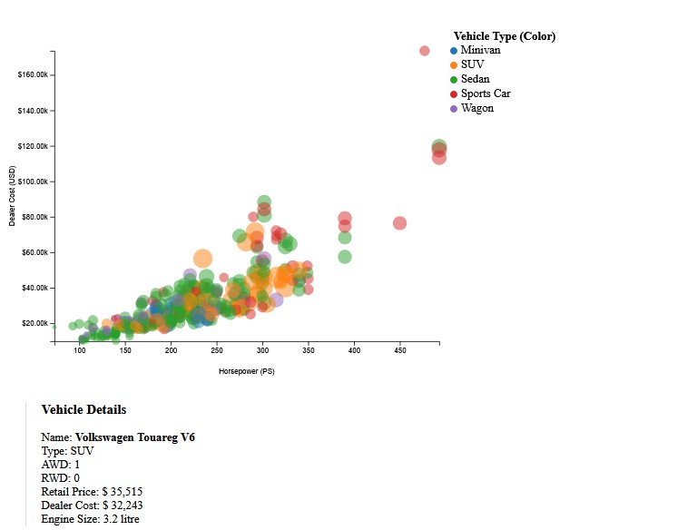

# DataVis Assignment 2
## First Attempt:
For the Assignment 2 initially I have chosen the following Variables for the plot (as you can see in the picture below):

- X-Axis: Horsepower
- Y-Axis: Dealer Cost
- Color: Vehicle Type
- Size (radius): Weight

Unfortunately, through the size of the circles it was really hard to distinguish the different circles in the plot. Therefore I have tried a new variable set up:

## Final Plot:

- X-Axis: Horsepower
- Y-Axis: Dealer Cost
- Color: Vehicle Type
- Shape (radius): AWD (y/n)

Instead of the weight as the size of a data dot I have chosen the AWD variable in two different shapes:
- circles for "No AWD"
- triangle for "AWD"

Furthermore I decided to change the Detail Overview from a text base solution to a table based solution beneath the plot.

The Star Plot next to the table visualizes the multivariate performance profile of the selected vehicle, comparing the following 6 attributes (normalized to the entire dataset):

- Retail Price

- Engine Size (l)

- Cylinders (Cyl)

- Horsepower (HP)

- City Miles Per Gallon (City MPG)

- Highway Miles Per Gallon (Highway MPG)

## Acknowledgements and Resources

This project served as my entry point into JavaScript development and data visualization with D3.js. The successful implementation of complex features and the stability of the final visualization were achieved through the use of the following resources:

- D3.js Official Documentation: Crucial for understanding the core concepts of data binding (General Update Pattern) and complex geometric functions for plotting.

- AI Assistant (Gemini): Used as an integral development partner throughout the project lifecycle. Its support was essential for tasks beyond standard debugging, including:

    - Architecture & Layout: Assisting with fundamental HTML structure and CSS Flexbox layout decisions to correctly position the main plot, table, and Star Plot.

    - Feature Implementation: Providing the complete logic for the dynamic HTML table updates and the complex Star Plot function (including polar coordinate conversion and rendering).

    - Data Integrity & Logic: Delivering critical solutions for data cleaning (filtering the specific MPG outliers) and establishing the robust normalization scales (Domain [0, Max]), which was necessary for accurate and meaningful visual representation in the Star Plot.
